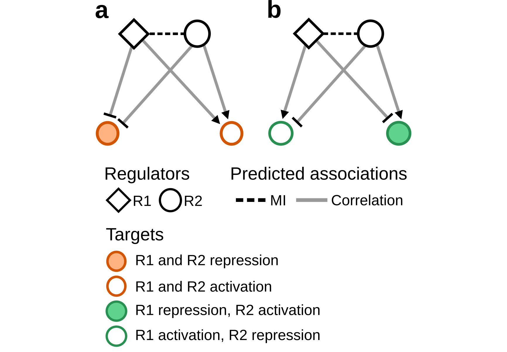

# Overview
Recurrent patterns in biological networks may reflect critical roles in multiple biological processes [@Bracken2016], for example, regulatory loops between transcription factors and microRNAs [@Zhang2015]. **RTNduals** searches for regulatory patterns between pairs of regulators, using regulatory networks generated by the **RTN package** (for details, please refer to the [RTN documentation](http://bioconductor.org/packages/RTN/)) [@Castro2016]. In such a network, each regulator has an associated set of target genes (i.e. a regulon), and when we assess the shared targets between a pair of regulators, we find triplets that may be regulated in a positive or negative direction, whith regulators either cooperating or competing in the regulatory network. The inference of *dual regulons* requires three complementary statistics: (1) Targets are assigned to regulons based on mutual information (MI) between the regulator and the target. The significance of the MI statistics is assessed by permutation and bootstrap analysis. (2) Shared targets between any two regulons are identified and the similarity in regulation (i.e. positive or negative direction) is assessed by correlation analysis. (3) A test is carried out to determine if the number of shared targets is higher than expected by chance. The schematics in **Figure 1** show two triplets formed between regulators. In (**a**) the two regulators co-operate by influencing shared targets in the same direction (co-activation or co-repression), while in (**b**) they compete, influencing targets in opposite directions. For gene expression data, typical regulators might include transcription factors, miRNAs, eRNAs and lncRNAs.



<b>Figure 1</b>.  Examples of regulators and predicted associations. This figure illustrates four triplets formed between regulators (<b>a</b>). Regulators R1 and R2 co-activate or co-repress shared targets. (<b>b</b>) Regulators R1 and R2 compete, influencing targets in opposite directions.

# Quick Start
The **RTNduals** workflow starts with a preprocessing step that generates a **TNI-class** object from an expression matrix and a list of regulators. The expression matrix is typically obtained from multiple samples (e.g. transcriptomes from a cancer cohort), while the list of regulators represents some prior biological information indicating which genes in the expression matrix should be regarded as regulators. The input data can also deal with different classes of regulators; for example, genes and microRNAs. In this case, the expression matrix should comprise mRNA and miRNA expression values.

## Load datasets
This example provides the data required to generate an **TNI-class** object. The dataset **tniData** is available from the **RTN** package and consists of an R list with 6 objects, 3 of which will be used in the subsequent analysis: (1) **expData**, a named gene expression matrix with 120 samples (genes in rows, samples in cols), (2) **rowAnnotation**, a data.frame with Probe-to-ENTREZ annotation, and (3) **tfs**, a character vector listing transcription factors. These datasets were extracted, pre-processed and size-reduced from @Fletcher2013, and should be regarded as examples for demonstration purposes only.

```{r include=FALSE}
library(RTNduals)
data("tniData", package = "RTN")
gexp <- tniData$expData
annot <- tniData$rowAnnotation
tfs <- c("IRF8","IRF1","PRDM1","E2F3","STAT4","LMO4","ZNF552")
```

```{r eval=FALSE}
##--- load package and dataset for demonstration
library(RTNduals)
data("tniData", package = "RTN")
gexp <- tniData$expData
annot <- tniData$rowAnnotation
tfs <- c("IRF8","IRF1","PRDM1","E2F3","STAT4","LMO4","ZNF552")
```

## Preprocessing
The **gexp** data matrix and the corresponding annotation are evaluated by the `tni.constructor` function in order to check the consistency of the input data. After this step it is generated a pre-processed **TNI-class** object whose status is updated to 'Preprocess [x]'.

```{r include=FALSE}
##--- generate a pre-processed TNI-class object
rtni <- tni.constructor(gexp, regulatoryElements = tfs, rowAnnotation=annot)
```

```{r eval=FALSE}
##--- generate a pre-processed TNI-class object
rtni <- tni.constructor(gexp, regulatoryElements = tfs, rowAnnotation=annot)
```

## Run permutation analysis
The `tni.permutation` method takes the pre-processed **TNI-class** object and returns a regulatory network inferred by mutual information analysis (with multiple hypothesis testing corrections).

```{r include=FALSE}
##--- compute a regulatory network (set nPermutations>=1000)
rtni <- tni.permutation(rtni, nPermutations=100, pValueCutoff=0.05, verbose=FALSE)
```

```{r eval=FALSE}
##--- compute a regulatory network (set nPermutations>=1000)
rtni <- tni.permutation(rtni, nPermutations=100, pValueCutoff=0.05)
```

## Run bootstrap analysis
In additional to the permutation analysis, the stability of the regulatory network is assessed by bootstrapping using the `tni.bootstrap` function.

```{r include=FALSE}
##--- check stability of the regulatory network (set nBootstrap>=100)
rtni <- tni.bootstrap(rtni, nBootstrap=10, verbose=FALSE)
```

```{r eval=FALSE}
##--- check stability of the regulatory network (set nBootstrap>=100)
rtni <- tni.bootstrap(rtni, nBootstrap=10)
```

```{r include=FALSE}
##--- Compute the DPI-filtered regulatory network
rtni <- tni.dpi.filter(rtni, eps = NA, verbose=FALSE)
```

```{r eval=FALSE}
##--- Compute the DPI-filtered regulatory network
# Note: we recommend setting 'eps = NA' in order to 
# estimate the threshold from the empirical null 
# distribution computed in the permutation and 
# bootstrap steps.
rtni <- tni.dpi.filter(rtni, eps = NA)
```

## Construct an MBR-class object and apply DPI algorithm
In a given regulatory network each target can be linked to multiple regulators as a result of both direct and indirect interactions. The Data Processing Inequality (DPI) algorithm [@Meyer2008] is used to remove the weakest interaction between two regulators and a common target.

```{r include=FALSE}
##--- construct an mbr object and apply DPI algorithm
rmbr <- tni2mbrPreprocess(rtni)
```

```{r eval=FALSE}
##--- construct an mbr object and apply DPI algorithm
rmbr <- tni2mbrPreprocess(rtni)
```

## Run association analysis between regulons
The `mbrAssociation` method takes the transcriptional network computed in the previous steps and enumerates all triplets formed by two regulatores and one shared target. The method retrieves the mutual information between regulators and assesses the agreement between the predicted downstream effects using correlation analysis. A Fisher’s exact test is used to evaluate whether the number of shared targets is greater than expected by chance.

```{r include=FALSE}
##--- test associations for dual regulons
rmbr <- mbrAssociation(rmbr, verbose=FALSE)
```

```{r eval=FALSE}
##--- test associations for dual regulons
rmbr <- mbrAssociation(rmbr)
```

A summary of the results can be accessed from 'rmbr' using the `mbrGet` function.

```{r eval=TRUE}
##--- check summary
mbrGet(rmbr, what="summary")
```

```{r eval=TRUE}
##--- get results
overlap <- mbrGet(rmbr, what="dualsOverlap")
correlation <- mbrGet(rmbr, what="dualsCorrelation")
```

Also, when prior evidences are available this method can add a 'supplementaryTable' regarding the association between regulators. The 'supplementaryTable' is a 'data.frame' listing unique relationships between any two regulators (please refer to the documentation for details on the input data format).

# Session information
```{r label='Session information', eval=TRUE, echo=FALSE}
sessionInfo()
```

# References


